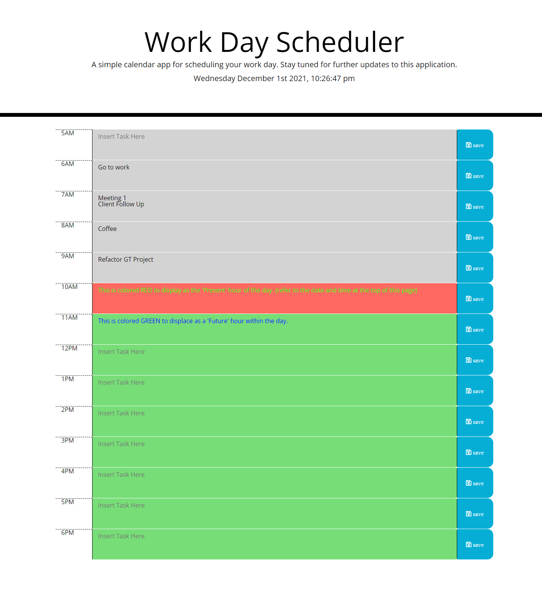

# Work Day Scheduler Application
A very simple application for scheduling tasks throughout your day. Stay tuned for further updates. 

## Live Page
 
https://kovaceva11.github.io/Work-Day-Scheduler/

## How It Works:
To begin planning your work day, enter your task(s) into the "Insert Take Here" field and click the save button to the right. This will save your task(s) into your local storage, for easy referencing throughout the day. 

Timeblocks that are in the Present hour of the day, will be colored Red. Timeblocks that are in the future will be colored Green.
Timeblocks in the past are Grey. 

# Demo Page

# Credits

W3 Schools HTML & CSS Tutorials [https://www.w3schools.com/](www.w3schools.com)

MDN Web Docs [https://developer.mozilla.org/en-US/](Developer.Mozilla.Org)

Font Awesome [https://fontawesome.com/](www.fontawesome.com)
> **Icon Package**: Free to use, no license required icon css styling package. Reference [./assets/css/all.css]

# The Code
Click here to view the Github Repo for this Work Day Scheduler! 
[https://github.com/Kovaceva11/Work-Day-Scheduler](www.github.com)
